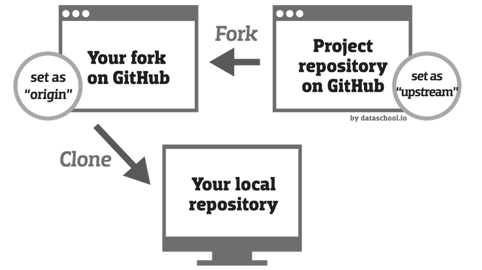
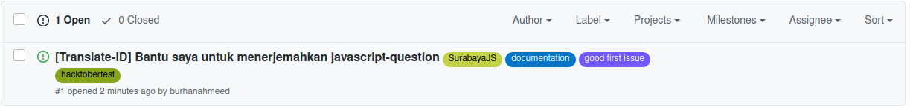
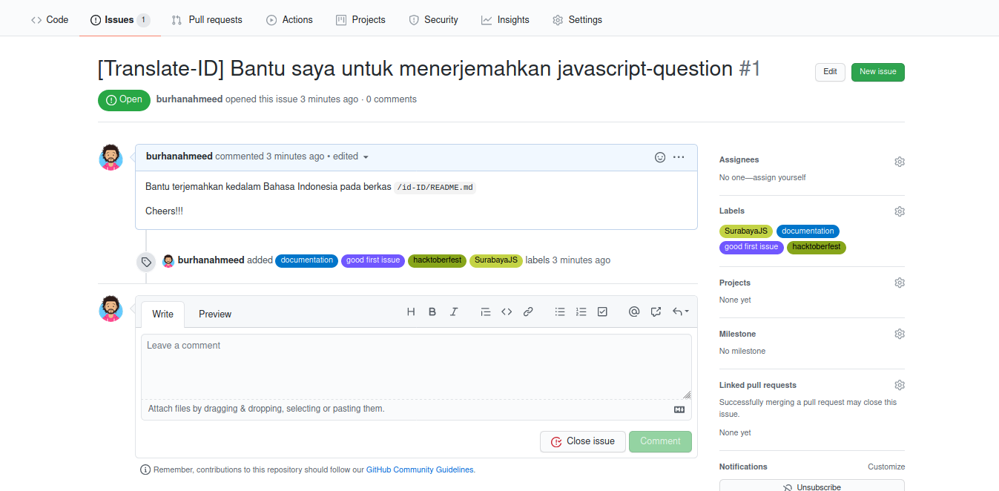
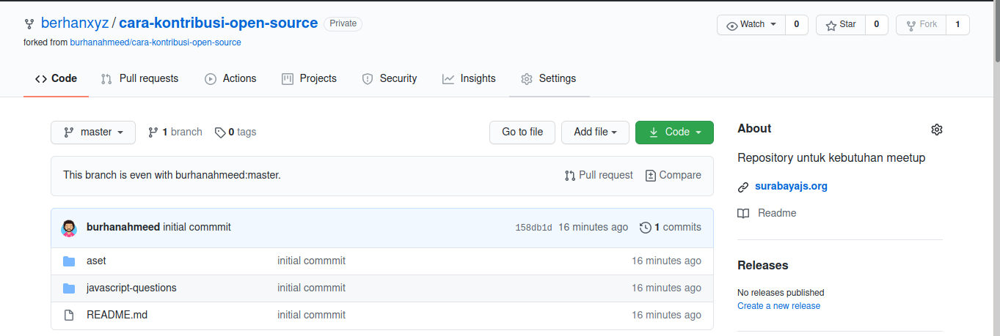
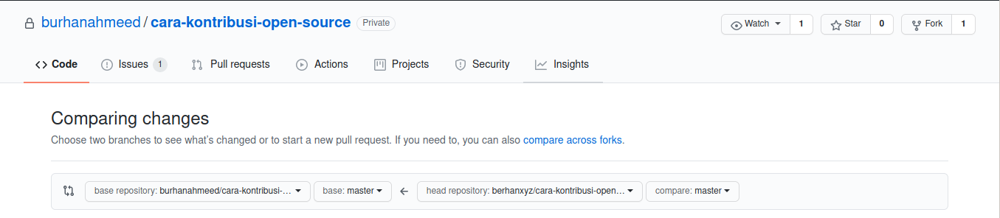

# SurabayaJS Edisi Hacktoberfest
---

Silahkan mendaftar ke situs [Hacktoberfest](https://hacktoberfest.digitalocean.com) jika belum mendaftar.

Aturan terbaru Hacktoberfest Per tanggal __3 Oktober 2020__

```
  PRs count if:
  Submitted during the month of October AND (
    The PR is labelled as hacktoberfest-accepted by a maintainer OR
    Submitted in a repo with the hacktoberfest topic AND (
      The PR is merged OR
      The PR has been approved
    )
  ) 
 
```

## _Forking_ repositori
Untuk memulai melakukan kontribusi hal pertama yang perlu dilakukan adalah melakukan _fork_ dari repositori yang ingin Anda berkontribusi.

Dalam hal ini Anda bisa melakukan _fork_ repo ini sebagai contoh.

 

## Clone repositori
Clone repositori ke komputer lokal Anda agar dapat melakukan perubahan pada repositori tersebut. Repositori yang di-clone adalah repo yang telah Anda fork, bukan repo induk yang Anda fork darinya.

```
git clone <URL REPOSITORI>
```

```
git clone https://github.com/<USERNAME PROFILE ANDA>/cara-kontribusi-open-source.git
```
Setelah itu, Anda bisa menuju direktori repositori yang telah di-clone dan membuka terminal dari direktori tersebut / arahkan _path_ terminal ke direktori tersebut.

## Mengatur _upstream remote URL_ 

Mengecek repositori _remote_
```
git remote -v
```

Anda tambahkan repositori untuk `upstream`, untuk menyamakan `origin` dan `upstream`.
```
git remote add upstream <URL_OF_FORK>
```
atau 
```
git remote add upstream https://github.com/burhanahmeed/cara-kontribusi-open-source
```

__Flow dari git repositori__


TADA!!!


## Etika Berkontribusi

## Buat Issue atau berkomentar di suatu Issue
 


## Mulai Beraksi
Alangkah baiknya sebelum mulai beraksi Anda bisa membuat _branch_ baru dari _branch_ `master`.

```
git checkout -b <NAMA BRANCH>
```
```
git checkout -b js-question-translate-13
```

## Membuat sebuah Pull Request (PR)
Anda dapat menuju halaman repositori yang telah Anda fork.
```
https://github.com/<USERNAME ANDA>/cara-kontribusi-open-source
```

Anda bisa buat PR disini


## Mereview PR Kontributor lainnya

Anda dapat memilih Pull Request yang memiliki status `OPEN` dan melakukan review disana.

Hamalan untuk melakukan _code review_


## Selamat Mencari Repo Lainnya

Daftar repositori untuk kontribusi (Hacktoberfest/non-hacktoberfest):